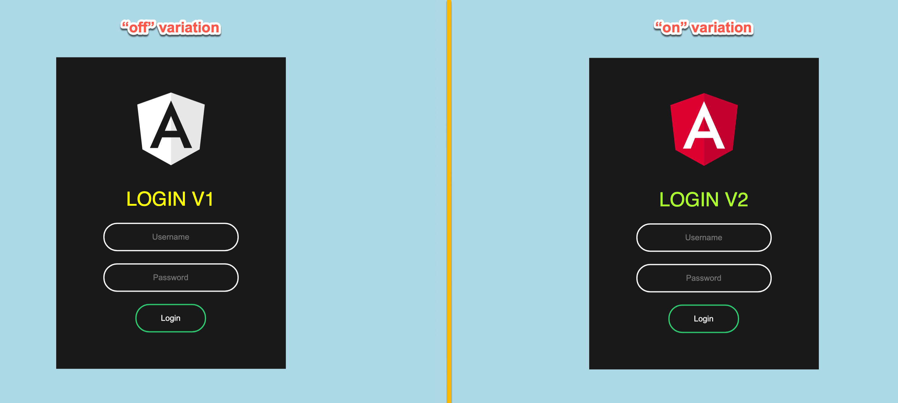

# Unlaunch Angular Demo

This project demonstrates how to use [Unlaunch JavaScript Library](https://github.com/unlaunch/javascript-sdk) with Angular JS. 

## Demo Overview

When the demo loads, you'd see "Login V1" and "Login V2" depending on the variation that was assigned. This demo uses a feature flag that is set to show "on" variation 50% of the time, and "off" variation the remaining 50%. 

### Important Notes about this Demo
1. The demo generates a random identity on each refresh so we can fetch a new variation each time. Don't do this in production as it will show a different variation to your users each time.
2. We have disabled local storage option when constructing the Unlaunch client in `unlaunch-service.ts`. Don't do this in your apps for performance reasons.

## How to run

## Development server

1. Run `npm install` or `npm i`
2. Run `ng serve -o`
3. Navigate to `http://localhost:4200/`. 

## About Unlaunch
Unlaunch is a Feature Release Platform for engineering teams. Our mission is allow engineering teams of all
 sizes to release features safely and quickly to delight their customers. To learn more about Unlaunch, please visit
  [https://unlaunch.io](https://unlaunch.io). You can sign up to get started for free at [https://app.unlaunch.io/signup
  ](https://app.unlaunch.io/signup).

## More Questions?
At Unlaunch, we are obsessed about making it easier for developers all over the world to release features safely and with confidence. If you have *any* questions or something isn't working as expected, please email **unlaunch@gmail.com**.
